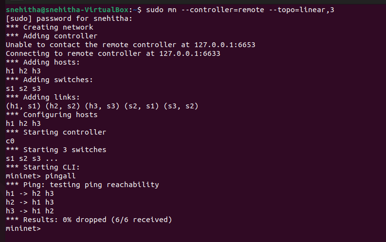
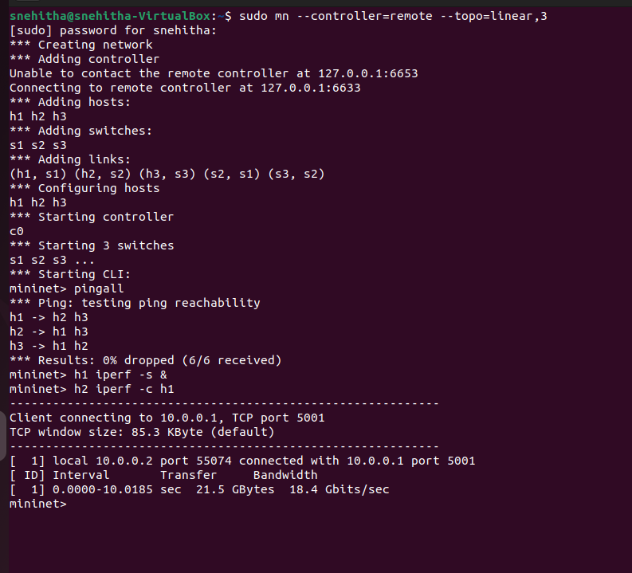
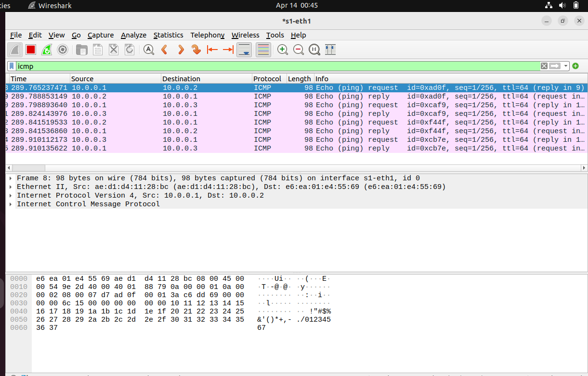
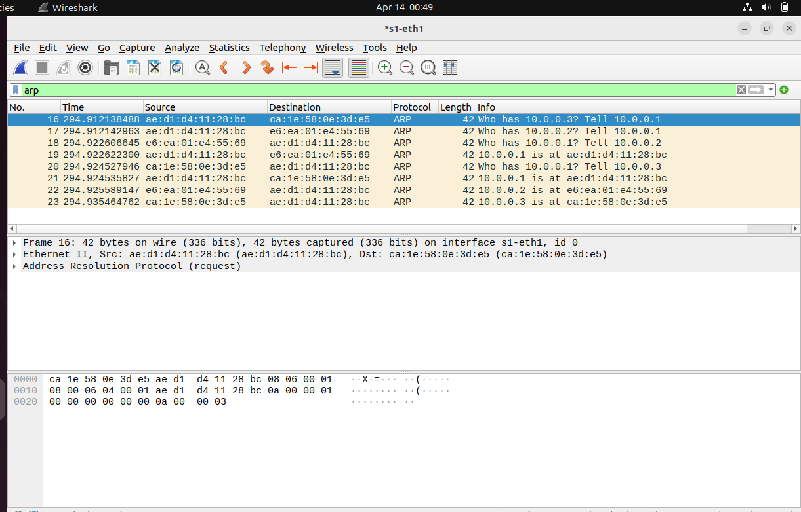
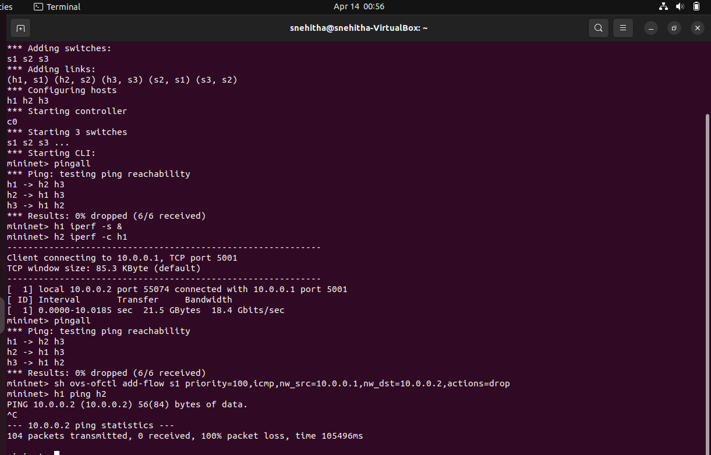

                                        SDN Mininet Experiment

Objective:

To create a software-defined network using Mininet, analyze traffic using Wireshark, and implement flow rules using OpenFlow.

 TOOLS USED:

* Mininet
* POX Controller
* Wireshark
* Open vSwitch
* Ubuntu (VirtualBox)

TOPOLOGY:

Linear topology with 3 hosts and 3 switches:

h1 --- s1 --- s2 --- s3 --- h3
              |
              h2         

(h1,s1) (h2,s2) (h3,s3)->topology

 STEPS PERFORMED:

 1. Create Network
sudo mn --controller=remote --topo=linear,3

2. Test Connectivity
pingall
 Result: 0% packet loss

3. Measure Bandwidth
h1 iperf -s &
h2 iperf -c h1
 Observed bandwidth successfully

 4. Packet Capture using Wireshark
* Captured traffic on interface `s1-eth1`

#ICMP Packets

* Used filter: "icmp"
* Observed ping request and reply packets

# ARP Packets

* Used filter: `arp`
* Observed address resolution process

5. Apply Flow Rule (Drop ICMP)
sh ovs-ofctl add-flow s1 priority=100,icmp,nw_src=10.0.0.1,nw_dst=10.0.0.2,actions=drop

6. Verify Rule
h1 ping h2
Result: 100% packet loss

## Screenshots
#Topology

#Ping Test

#Bandwidth

#ICMP Packets

### ARP Packets

#Flow Rule Drop

# Conclusion

* Successfully created SDN topology using Mininet
* Verified connectivity and bandwidth
* Captured ICMP and ARP packets using Wireshark
* Implemented OpenFlow rule to block ICMP traffic

##  Author:
Snehitha
